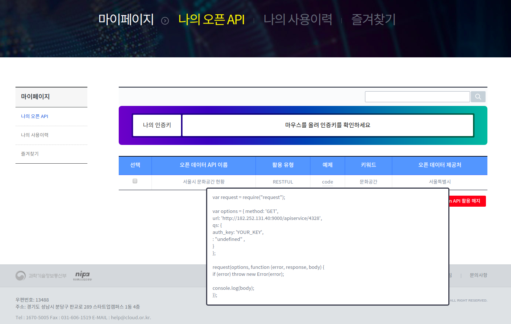

#### Kakao 지도 Javscript API 

키 발급을 받아야 사용할 수 있습니다. 키를 발급받기 위해서는 카카오 계정이 필요합니다.

1. *[카카오 개발자사이트](https://developers.kakao.com/)* (https://developers.kakao.com) 접속
2. 개발자 등록 및 앱 생성
3. 웹 플랫폼 추가: 앱 선택 – [설정] – [일반] – [플랫폼 추가] – 웹 선택 후 추가
4. 사이트 도메인 등록: [웹] 플랫폼을 선택하고, [사이트 도메인] 을 등록합니다. (예: http://localhost:8080)
5. 페이지 상단의 [JavaScript 키]를 지도 API의 appkey로 사용합니다.
6. 앱을 실행합니다.


[참고사이트] : http://apis.map.kakao.com/web/guide/


#### OpenData API

키 발급을 받아야 사용할 수 있습니다. 키를 발급받기 위해서는 회원가입 후 별도의 신청과정이 필요합니다.

[참고사이트] : http://182.252.131.40:3000/

1. 회원가입


2. 서울시 문화공간현황 검색


3. 검색결과 중, 원하는 데이터의 세부 화면에서 활용목적 선택 후 해당 데이터 api 신청


4. 마이페이지 - 나의 오픈 API 메뉴에서 신청한 api 와 인증키 확인




5. backend 앱의 application.properties에 api 주소와, 발급받은 key 정보 입력

* api url : 예제 컬럼의 code 부분에서 api 정보를 얻을 수 있음 ( http://182.252.131.40:9000/apiservice/4328)

* authKey : 발급받은 인증키


#### MySQL 연결 정보

backend 앱의 application.properties의 설정 값 이용

````
jdbc:mysql://(주소):3306/(DB명)?useSSL=false&useUnicode=true&characterEncoding=utf8
````


1. CF marketplace를 이용한 mysql의 경우

마켓플레이스에서 사용할 서비스의 인스턴스를 생성하고, 해당 서비스를 사용할 앱과 바인딩 한 후 이용

````
# marketplace에서 사용할 서비스 검색
cf marketplace
````


````
# 사용할 서비스 인스턴스 생성
cf create-service (SERVICE) (PLAN) (SERVICE-INSTANCE)
cf create-service  p-mysql   20mb   test-mysql

# 생성한 서비스 인스턴스 조회
cf services

# 생성한 서비스인스턴스와 해당서비스를 이용할 앱 바인딩
cf bind-service (APP_NAME) (SERVICE-INSTANCE)
cf bind-service search-service test-mysql
````


backend app의 env 조회를 통해 바인딩 되어있는 mysql 정보 확인

````
# 해당 앱의 환경정보
cf env (backend app 이름)

# DB관련 정보
hostname: application.properties 주소
name: application.properties의 DB명
password: application.properties의 password
username: application.properties의 username
````


2. 설치해서 사용하는 mysql의 경우

사용할 Database create 후, application.properties의 DB정보에 해당 데이터베이스의 이름, mysql이 설치된 곳의 ip, mysql 로그인 id, password 입력


#### Manifest.yml 작성법

````
---
applications:
  - name: (cf에 push되는 앱 이름)
    memory: 1G
    path: (jar파일이 있는 경로)/(jar파일).jar
    buildpack: java_buildpack
    env:
      msa: yes
      private: (paasta 계정 id)
````


#### CF Push

사용할 조직과 스페이스를 생성하고, 타겟을 설정한다. 

manifest.yml 파일과 jar 파일을 준비하고, cf push 명령어를 통해 cf 상에 앱을 push 한다

````
# cf 조직 생성
cf create-org (생성할조직 이름)
cf create-org sample-org

# cf 스페이스 생성
cf create-space (생성할 스페이스 이름) -o (생성된 조직 이름)
cf create-space sample-space -o sample-org

# cf target 설정
cf target -o (조직이름) -s (스페이스이름)
cf target -o sample-org -s sample-space

# cf app push
cf push
````

